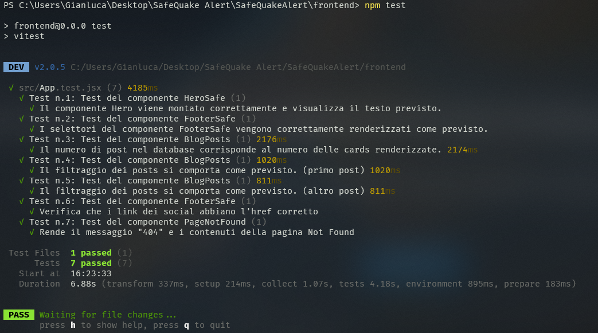

# SafeQuake Alert - Frontend 🌍

## Descrizione
Il frontend di SafeQuake Alert è l'interfaccia utente del sistema di allerta terremoti. Consente agli utenti di visualizzare avvisi, monitorare la situazione in tempo reale su una mappa interattiva, e ricevere notifiche. L'interfaccia è progettata con React e include mappe e grafici per la visualizzazione dei dati.

## 🛠️ Tecnologie utilizzate
- **React.js**: Libreria JavaScript per la creazione di interfacce utente.
- **React Router**: Per la gestione della navigazione tra le pagine.
- **Bootstrap e React Bootstrap**: Per la progettazione del layout e degli stili.
- **Chart.js e React-Chartjs-2**: Per la visualizzazione di grafici relativi ai dati dei terremoti. **(da implementare)**
- **Leaflet e React-Leaflet**: Per la visualizzazione di mappe interattive.
- **Socket.io-client**: Per ricevere notifiche in tempo reale dal backend.
- **i18next e React-i18next**: Per la gestione della localizzazione e delle traduzioni.
- **Firebase**: Per l'autenticazione e la gestione di notifiche push.
- **AOS (Animate on Scroll)**: Per animazioni fluide durante lo scrolling della pagina.
- **React Hot Toast**: Per le notifiche visive agli utenti.

## 🚀 Comandi per iniziare il progetto

1. Clonare il repository:
    ```bash
    git clone https://github.com/nagcas/SafeQuake-Alert.git
    cd frontend
    ```

2. Installare le dipendenze:
    ```bash
    npm install
    ```

3. Avviare il server di sviluppo:
    ```bash
    npm run dev
    ```

4. Costruire il progetto per la produzione:
    ```bash
    npm run build
    ```

5. Avviare l'anteprima del progetto:
    ```bash
    npm run preview
    ```

## ℹ️ Note aggiuntive
- 🔧 Assicurarsi di avere configurato correttamente Firebase per l'autenticazione e le notifiche.
- ⚡ Il progetto utilizza Vite per il bundling e lo sviluppo rapido.
- 🧪 Testare il codice con Vitest:
    ```bash
    npm run test
    ```

## ℹ️ Alcuni test eseguiti


